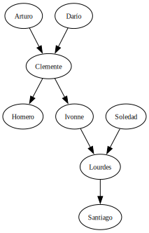
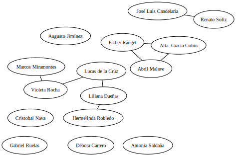

<section class="aside" markdown="1">

## setup

-   Download [the latest release][release]
-   Unzip the file in a temporary directory to create:
    -   `./db/*.db`: the SQLite databases used in the examples
    -   `./src/*.*`: SQL queries, Python scripts, and other source code
    -   `./out/*.*`: expected output for examples

</section>
<section class="aside" markdown="1">

## background concepts

-   A ___database___ is a collection of data that can be searched and retrieved
-   A ___database management system___ (DBMS) is a program that manages a particular kind of database
-   Each DBMS stores data in its own way
    -   [SQLite][sqlite] stores each database in a single file
    -   [PostgreSQL][postgresql] spreads information across many files for higher performance
-   DBMS can be a library embedded in other programs ([SQLite][sqlite]) or a server ([PostgreSQL][postgresql])
-   A ___relational database management system___ (RDBMS) stores data in tables and uses [SQL][sql] for queries
    -   Unfortunately, every RDBMS has its own dialect of SQL
-   There are also ___NoSQL databases___ like [MongoDB][mongodb] that don't use tables

</section>
<section class="aside" markdown="1">

## connect to database



-   Not actually a query
-   But we have to do it before we can do anything else

</section>
<section markdown="1">

## 001: select constant



-   `select` is a keyword
-   Normally used to select data from table…
-   …but if all we want is a constant value, we don't need to specify one
-   Semi-colon terminator is required

</section>
<section markdown="1">

## 002: select all values from table



-   Use `*` to mean "all columns"
-   Use <code>from <em>tablename</em></code> to specify table
-   Output format is not particularly readable

</section>
<section class="aside" markdown="1">

## administrative commands



-   SQLite administrative commands start with `.` and *aren't* part of the SQL standard
    -   PostgreSQL's special commands start with `\`
-   Use `.help` for a complete list

</section>
<section markdown="1">

## 003: specify columns



-   Specify column names separated by commas
    -   In any order
    -   Duplicates allowed
-   Line breaks <strike>allowed</strike> encouraged for readability

</section>
<section markdown="1">

## 004: sort



-   `order by` must follow `from` (which must follow `select`)
-   `asc` is ascending, `desc` is descending
    -   Default is ascending, but please specify

</section>
<section markdown="1">

## 005: limit output

-   Full dataset has 344 rows



-   Comments start with `--` and run to the end of the line
-   <code>limit <em>N</em></code> specifies maximum number of rows returned by query

</section>
<section markdown="1">

## 006: page output



-   <code>offset <em>N</em></code> must follow `limit`
-   Specifies number of rows to skip from the start of the selection
-   So this query skips the first 3 and shows the next 10

</section>
<section markdown="1">

## 007: remove duplicates



-   `distinct` keyword must appear right after `select`
    -   SQL was supposed to read like English
-   Shows distinct combinations
-   Blanks in `sex` column show missing data
    -   We'll talk about this in a bit

</section>
<section markdown="1">

## 008: filter results



-   <code>where <em>condition</em></code> ___filters___ the rows produced by selection
-   Condition is evaluated independently for each row
-   Only rows that pass the test appear in results
-   Use single quotes for `'text data'` and double quotes for `"weird column names"`
    -   SQLite will accept double-quoted text data

</section>
<section markdown="1">

## 009: filter with more complex conditions



-   `and`: both sub-conditions must be true
-   `or`: either or both part must be true
-   Notice that the row for Gentoo penguins on Biscoe island with unknown (empty) sex didn't pass the test
    -   We'll talk about this in a bit

</section>
<section markdown="1">

## 010: do calculations



-   Can do the usual kinds of arithmetic on individual values
    -   Calculation done for each row independently
-   Column name shows the calculation done

</section>
<section markdown="1">

## 011: rename columns



-   Use <code><em>expression</em> as <em>name</em></code> to rename
-   Give result of calculation a meaningful name
-   Can also rename columns without modifying

</section>
<section class="aside" markdown="1">

## check your understanding

</section>
<section markdown="1">

## 012: calculate with missing values


-   SQL uses a special value `null` to representing missing data
    -   Not 0 or empty string, but "I don't know"
-   Flipper length and body weight not known for one of the first five penguins
-   "I don't know" divided by 10 or 1000 is "I don't know"

</section>
<section markdown="1">

## 013: null equality

-   Repeated from above so it doesn't count against our query limit



-   If we ask for female penguins the row with the missing sex drops out



</section>
<section markdown="1">

## 014: null inequality

-   But if we ask for penguins that *aren't* female it drops out as well



</section>
<section markdown="1">

## 015: ternary logic



-   If we don't know the left and right values, we don't know if they're equal or not
-   So the result is `null`
-   Get the same answer for `null != null`
-   ___Ternary logic___

<table>
  <tr>
    <th colspan="4">equality</th>
  </tr>
  <tr>
    <th></th>
    <th>X</th>
    <th>Y</th>
    <th>null</th>
  </tr>
  <tr>
    <th>X</th>
    <td>true</td>
    <td>false</td>
    <td>null</td>
  </tr>
  <tr>
    <th>Y</th>
    <td>false</td>
    <td>true</td>
    <td>null</td>
  </tr>
  <tr>
    <th>null</th>
    <td>null</td>
    <td>null</td>
    <td>null</td>
  </tr>
</table>

</section>
<section markdown="1">

## 016: handle null safely



-   Use `is null` and `is not null` to handle null safely
-   Other parts of SQL handle nulls specially

</section>
<section class="aside" markdown="1">

## check your understanding

</section>
<section markdown="1">

## 017: aggregate



-   `sum` is an ___aggregation function___
-   Combines corresponding values from multiple rows

</section>
<section markdown="1">

## 018: common aggregation functions



-   This actually shouldn't work:
    can't calculate maximum or average if any values are null
-   SQL does the useful thing instead of the right one

</section>
<section markdown="1">

## 019: counting



-   `count(*)` counts rows
-   <code>count(<em>column</em>)</code> counts non-null entries in column

</section>
<section markdown="1">

## 020: group



-   Put rows in ___groups___ based on distinct combinations of values in columns specified with `group by`
-   Then perform aggregation separately for each group
-   But which is which?

</section>
<section markdown="1">

## 021: behavior of unaggregated columns



-   All rows in each group have the same value for `sex`, so no need to aggregate

</section>
<section markdown="1">

## 022: arbitrary choice in aggregation



-   If we don't specify how to aggregate a column, SQL can choose *any arbitrary value* from the group
-   All penguins in each group have the same sex because we grouped by that, so we get the right answer
-   The body mass values are in the data but unpredictable
-   A common mistake

</section>
<section markdown="1">

## 023: filter aggregated values



-   Using <code>having <em>condition</em></code> instead of <code>where <em>condition</em></code> for aggregates

</section>
<section markdown="1">

## 024: readable output



-   Use <code>round(<em>value</em>, <em>decimals</em>)</code> to round off a number

</section>
<section markdown="1">

## 025: filter aggregate inputs



-   <code>filter (where <em>condition</em>)</code> applies to *inputs*

</section>
<section class="aside" markdown="1">

## check your understanding

</section>
<section class="aside" markdown="1">

## create in-memory database



-   "Connect" to an ___in-memory database___

</section>
<section markdown="1">

## 026: create tables




-   <code>create table <em>name</em></code> followed by parenthesized list of columns
-   Each column is a name, a data type, and optional extra information
    -   E.g., `not null` prevents nulls from being added
-   `.schema` is *not* standard SQL
-   SQLite has added a few things
    -   `create if not exists`
    -   upper-case keywords (SQL is case insensitive)

</section>
<section markdown="1">

## 027: insert data



</section>
<section markdown="1">

## 028: update rows



-   (Almost) always specify row(w) to update using `where`
    -   Would otherwise update all rows
-   Useful to give each row a ___primary key___ that uniquely identifies it for this purpose
    -   Will see other uses below

</section>
<section markdown="1">

## 029: delete rows



-   Again, (almost) always specify row(s) to delete using `where`

</section>
<section markdown="1">

## 030: backing up



</section>
<section markdown="1">

## 031: join tables



-   `cross join` (also called ___outer join_) constructs cross product of tables
    -   All combinations of rows from each
-   Result isn't particularly useful: `job` and `name` don't match

</section>
<section markdown="1">

## 032: inner join



-   Use <code><em>table</em>.<em>column</em></code> notation to specify columns
    -   A column can have the same name as a table
-   Use <code>on <em>condition</em></code> to specify ___join condition___
-   Since `complain` doesn't appear in `job.name`, none of those rows are kept

</section>
<section markdown="1">

## 033: aggregate joined data



-   Combines ideas we've seen before
-   But Tay is missing from the table

</section>
<section markdown="1">

## 034: left join



-   A ___left outer join___ keeps all rows from the left table
-   Fills missing values from right table with null

</section>
<section markdown="1">

## 035: aggregate left joins



-   That's better, but we'd like to see 0 rather than a blank

</section>
<section markdown="1">

## 036: coalesce values



-   <code>coalesce(<em>val1</em>, <em>val2</em>, …)</code> returns first non-null value

</section>
<section markdown="1">

## 037: negate incorrectly

-   Who doesn't calibrate?



-   But Mik *does* calibrate
-   Problem is that there's an entry for Mik cleaning
-   And since `'clean' != 'calibrate'`, that row is included in the results
-   We need a different approach

</section>
<section markdown="1">

## 038: set membership



-   <code>in <em>values</em></code> and <code>not in <em>values</em></code> do exactly what you expect

</section>
<section markdown="1">

## 039: subqueries



-   Use a ___subquery___ to select the people who *do* calibrate
-   Then select all the people who aren't in that set
-   Initially feels odd, but subqueries are useful in other ways

</section>
<section class="aside" markdown="1">

## M to N relationships

-   Relationships between entities are usually characterized as:
    -   1-to-1: fields in the same record
    -   1-to-many: the many have a ___foreign key___ referring to the one's primary key
    -   many-to-many: don't know how many keys to add to records ("maximum" never is)
-   Nearly-universal solution is a ___join table___
    -   Each record is a pair of foreign keys
    -   I.e., each record is the fact that records A and B are related

</section>
<section markdown="1">

## 040: autoincrement and primary key



-   Database ___autoincrements___ `ident` each time a new record is added
-   Use that field as the primary key
    -   So that if Mik changes their name again,
        we only have to change one fact in the database
    -   Downside: manual queries are harder to read (who is person 17?)

</section>
<section class="aside" markdown="1">

## internal tables



-   Sequence numbers are *not* reset when rows are deleted

</section>
<section markdown="1">

## 041: alter tables



-   Add a column after the fact
-   Since it can't be null, we have to provide a default value
    -   Really want to make it the primary key, but SQLite doesn't allow that (easily) after the fact
-   Then use `update` to modify existing records
    -   Can modify any number of records at once
    -   So be careful about `where` clause
-   ___Data migration___

</section>
<section markdown="1">

## 042: create new tables from old



-   `new_work` is our join table
-   Each column refers to a record in some other table

</section>
<section markdown="1">

## 043: remove tables



-   Remove the old table and rename the new one to take its place
    -   Note `if exists`
-   Be careful…

</section>
<section markdown="1">

## 044: compare individual values to aggregates

-   Go back to penguins



-   Get average body mass in subquery
-   Compare each row against that
-   Requires two scans of the data, but there's no way to avoid that
-   Null values aren't included in the average or in the final results

</section>
<section markdown="1">

## 045: compare individual values to aggregates within groups



-   Subquery runs first to create temporary table `averaged` with average mass per species
-   Join that with `penguins`
-   Filter to find penguins heavier than average within their species

</section>
<section markdown="1">

## 046: common table expressions



-   Use ___common table expression___ (CTE) to make queries clearer
    -   Nested subqueries quickly become difficult to understand
-   Database decides how to optimize

</section>
<section class="aside" markdown="1">

## explain query plan



-   SQLite plans to scan every row of the table
-   It will build a temporary B-tree data structure to group rows

</section>
<section markdown="1">

## 047: enumerate rows

-   Every table has a special column called `rowid`



-   `rowid` is persistent within a session
    -   I.e., if we delete the first 5 rows we now have row IDs 6…N
-   *Do not rely on row ID*
    -   In particular, do not use it as a key

</section>
<section markdown="1">

## 048: if-else function



-   <code>iif(<em>condition</em>, <em>true_result</em>, <em>false_result</em>)</code>
    -   Note: `iif` with two i's

</section>
<section markdown="1">

## 049: select a case

-   What if we want small, medium, and large?
-   Can nest `iif`, but quickly becomes unreadable



-   Evaluate `when` options in order and take first
-   Result of `case` is null if no condition is true
-   Use `else` as fallback

</section>
<section markdown="1">

## 050: check range



-   `between` can make queries easier to read
-   But be careful of the `and` in the middle

</section>
<section class="aside" markdown="1">

## yet another database

-   ___Entity-relationship diagram___ (ER diagram) shows relationships between tables
-   Like everything to do with databases, there are lots of variations



</section>
<section markdown="1">

## 051: pattern matching



-   `like` is the original SQL pattern matcher
    -   `%` matches zero or more characters at the start or end of a string
    -   Case insensitive by default
-   `glob` supports Unix-style wildcards

| name      | purpose |
| --------- | ------- |
| `substr`  | Get substring given starting point and length |
| `trim`    | Remove characters from beginning and end of string |
| `ltrim`   | Remove characters from beginning of string |
| `rtrim`   | Remove characters from end of string |
| `length`  | Length of string |
| `replace` | Replace occurrences of substring with another string |
| `upper`   | Return upper-case version of string |
| `lower`   | Return lower-case version of string |
| `instr`   | Find location of first occurrence of substring (returns 0 if not found) |

</section>
<section markdown="1">

## 052: select first and last rows



-   `union all` combines records
    -   Keeps duplicates: `union` on its own keeps unique records
-   Yes, it feels like the extra `select * from` should be unnecessary

</section>
<section markdown="1">

## 053: intersection



-   Tables being intersected must have same structure
-   Intersection usually used when pulling values from different tables
    -   In this case, would be clearer to use `where`

</section>
<section markdown="1">

## 054: exclusion



-   Again, tables must have same structure
    -   And this would be clearer with `where`
-   SQL operates on sets, not tables, except where it doesn't

</section>
<section markdown="1">

## 055: random numbers and why not



-   There is no way to seed SQLite's random number generator
-   Which means there is no way to reproduce one of its "random" sequences

</section>
<section markdown="1">

## 056: creating index



-   An ___index___ is an auxiliary data structure that enables faster access to records
    -   Spend storage space to buy speed
-   Don't have to mention it explicitly in queries
    -   Database manager will use it automatically

</section>
<section markdown="1">

## 057: generate sequence



-   A (non-standard) ___table-valued function___

</section>
<section markdown="1">

## 058: generate sequence based on data



-   Must have the parentheses around the `min` and `max` selections to keep SQLite happy

</section>
<section markdown="1">

## 059: generate sequence of dates



-   SQLite represents dates as YYYY-MM-DD strings
    or as Julian days or as Unix milliseconds or…
    -   Julian days is fractional number of days since November 24, 4714 BCE
-   `julianday` and `date` convert back and forth

</section>
<section markdown="1">

## 060: count experiments started per day without gaps



</section>
<section markdown="1">

## 061: self join



-   Join a table to itself
    -   Use `as` to create ___aliases___ for copies of tables to distinguish them
    -   Nothing special about the names `left` and `right`
-   Get all <math>n2</math> pairs, including person with themself

</section>
<section markdown="1">

## 062: generate unique pairs



-   `left.ident < right.ident` ensures distinct pairs without duplicates
-   Use `left.ident <= 4 and right.ident <= 4` to limit output
-   Quick check: <math>n(n-1)/2</math> pairs

</section>
<section markdown="1">

## 063: filter pairs



</section>
<section markdown="1">

## 064: existence and correlated subqueries



-   Nobody works in Endocrinology
-   `select 1` could equally be `select true` or any other value
-   A ___correlated subquery___ depends on a value from the outer query
    -   Equivalent to nested loop

</section>
<section markdown="1">

## 065: nonexistence



</section>
<section class="aside" markdown="1">

## avoiding correlated subqueries



-   The join might or might not be faster than the correlated subquery
-   Hard to find unstaffed departments without either `not exists` or `count` and a check for 0

</section>
<section markdown="1">

## 066: lead and lag



-   Use `strftime` to extract year and month
    -   Clumsy, but date/time handling is not SQLite's strong point
-   Use ___window functions___ `lead` and `lag` to shift values
    -   Unavailable values are null

</section>
<section markdown="1">

## 067: window functions



-   `sum() over` does a running total
-   `cume_dist` is fraction *of rows seen so far*

</section>
<section class="aside" markdown="1">

## explain another query plain



-   Becomes useful…eventually

</section>
<section markdown="1">

## 068: partitioned windows



-   `partition by` creates groups
-   So this counts experiments started since the beginning of each year

</section>
<section markdown="1">

## 069: blobs



-   A ___blob___ is a binary large object
    -   Bytes in, bytes out…
-   If you think that's odd, check out [Fossil][fossil]

</section>
<section class="aside" markdown="1">

## yet another database




</section>
<section markdown="1">

## 070: store JSON



-   Store heterogeneous data as JSON-formatted text (with double-quoted strings)
    -   Database parses it each time it is queried
-   Alternatively store as blob
    -   Can't just view it
    -   But more efficient

</section>
<section markdown="1">

## 071: select field from JSON



-   Single arrow `->` returns JSON representation result
-   Double arrow `->>` returns SQL text, integer, real, or null
-   Left side is column
-   Right side is ___path expression___
    -   Start with `$` (meaning "root")
    -   Fields separated by `.`

</section>
<section markdown="1">

## 072: JSON array access



-   SQLite (and other database managers) has lots of JSON manipulation functions
-   `json_array_length` gives number of elements in selected array
-   subscripts start with 0
-   Characters outside 7-bit ASCII represented as Unicode escapes

</section>
<section markdown="1">

## 073: unpack JSON array



-   `json_each` is another table-valued function
-   Use <code>json_each.<em>name</em></code> to get properties of unpacked array

</section>
<section markdown="1">

## 074: last element of array



</section>
<section markdown="1">

## 075: modify JSON



-   Updates the in-memory copy of the JSON, *not* the database record
-   Please use `json_quote` rather than trying to format JSON with string operations

</section>
<section class="aside" markdown="1">

## refresh penguins



-   We will restore full database after each example

</section>
<section markdown="1">

## 076: tombstones




-   Use a ___tombstone___ to mark (in)active records
-   Every query must now include it

</section>
<section markdown="1">

## 077: views



-   A ___view___ is a saved query that other queries can invoke
-   View is re-run each time it's used
-   Like a CTE, but:
    -   Can be shared between queries
    -   Views came first
-   Some databases offer ___materialized views___
    -   Update-on-demand temporary tables

</section>
<section class="aside" markdown="1">

## hours reminder



</section>
<section markdown="1">

## 078: add check



-   `check` adds constraint to table
    -   Must produce a Boolean result
    -   Run each time values added or modified
-   But changes made before the error have taken effect

</section>
<section class="aside" markdown="1">

## ACID

-   ___Atomic_: change cannot be broken down into smaller ones (i.e., all or nothing)
-   ___Consistent_: database goes from one consistent state to another
-   ___Isolated_: looks like changes happened one after another
-   ___Durable_: if change takes place, it's still there after a restart

</section>
<section markdown="1">

## 079: transactions



-   Statements outside transaction execute and are committed immediately
-   Statement(s) inside transaction don't take effect until:
    -   `end transaction` (success)
    -   `rollback` (undo)
-   Can have any number of statements inside a transaction
-   But *cannot* nest transactions in SQLite
    -   Other databases support this

</section>
<section markdown="1">

## 080: rollback in constraint



-   All of second `insert` rolled back as soon as error occurred
-   But first `insert` took effect

</section>
<section markdown="1">

## 081: rollback in statement



-   Constraint is in table definition
-   Action is in statement

</section>
<section markdown="1">

## 082: upsert



-   ___upsert__ stands for "update or insert"
    -   Create if record doesn't exist
    -   Update if it does
-   Not standard SQL but widely implemented
-   Example also shows use of SQLite `.print` command

</section>
<section class="aside" markdown="1">

## normalization

-   First normal form (1NF):
    every field of every record contains one indivisible value.

-   Second normal form (2NF) and third normal form (3NF):
    every value in a record that isn't a key depends solely on the key,
    not on other values.

-   ___Denormalization_: explicitly store values that could be calculated on the fly
    -   To simplify queries and/or make processing faster

</section>
<section markdown="1">

## 083: create trigger

-   A ___trigger___ automatically runs before or after a specified operation
-   Can have side effects (e.g., update some other table)
-   And/or implement checks (e.g., make sure other records exist)
-   Add processing overhead…
-   …but data is either cheap or correct, never both
-   Inside trigger, refer to old and new versions of record
    as <code>old.<em>column</em></code> and <code>new.<em>column</em></code>




</section>
<section markdown="1">

# 081: trigger firing



</section>
<section class="aside" markdown="1">

## represent graphs




</section>
<section markdown="1">

## 084: recursive query



-   Use a ___recursive CTE___ to create a temporary table (`descendent`)
-   ___Base case___ seeds this table
-   ___Recursive case___ relies on value(s) already in that table and external table(s)
-   `union all` to combine rows
    -   Can use `union` but that has lower performance (must check uniqueness each time)
-   Stops when the recursive case yields an empty row set (nothing new to add)
-   Then select the desired values from the CTE

</section>
<section class="aside" markdown="1">

## contact tracing database




</section>
<section markdown="1">

## 085: bidirectional contacts



-   Create a ___temporary table___ rather than using a long chain of CTEs
    -   Only lasts as long as the session (not saved to disk)
-   Duplicate information rather than writing more complicated query

</section>
<section markdown="1">

## 086: update group identifiers



-   `new_ident` is minimum of own identifier and identifiers one step away
-   Doesn't keep people with no contacts

</section>
<section markdown="1">

## 087: recursive labeling



-   Use `union` instead of `union all` to prevent ___infinite recursion___

</section>
<section markdown="1">

## 088: query from Python



-   `sqlite3` is part of Python's standard library
-   Create a connection to a database file
-   Get a ___cursor___ by executing a query
    -   More common to create cursor and use that to run queries
-   Fetch all rows at once as list of tuples

</section>
<section markdown="1">

## 089: incremental fetch



-   `cursor.fetchone` returns `None` when no more data
-   There is also `fetchmany(N)` to fetch (up to) a certain number of rows

</section>
<section markdown="1">

## 090: insert, delete, and all that



-   Each `execute` is its own transaction

</section>
<section markdown="1">

## 091: interpolate values



-   From [XKCD][xkcd-tables]

</section>
<section markdown="1">

## 092: script execution



-   But what if something goes wrong?

</section>
<section markdown="1">

## 093: SQLite exceptions in Python



</section>
<section markdown="1">

## 094: Python in SQLite



-   SQLite calls back into Python to execute the function
-   Other databases can run Python (and other languages) in the database server process
-   Be careful

</section>
<section markdown="1">

## 095: handle dates and times



-   `sqlite3.PARSE_DECLTYPES` tells `sqlite3` library to use converts based on declared column types
-   Adapt on the way in, convert on the way out

</section>
<section markdown="1">

## 096: SQL in Jupyter notebooks



-   And then inside the notebook:



-   Loads extension



-   Connects to database
    -   `sqlite://` with two slashes is the protocol
    -   `/data/penguins.db` (one leading slash) is a local path
-   Single percent sign `%sql` introduces one-line command
-   Use double percent sign `%%sql` to indicate that the rest of the cell is SQL



<table>
  <thead>
    <tr>
      <th>species</th>
      <th>num</th>
    </tr>
  </thead>
  <tbody>
    <tr>
      <td>Adelie</td>
      <td>152</td>
    </tr>
    <tr>
      <td>Chinstrap</td>
      <td>68</td>
    </tr>
    <tr>
      <td>Gentoo</td>
      <td>124</td>
    </tr>
  </tbody>
</table>

</section>
<section markdown="1">

## 097: Pandas and SQL




-   Be careful about datatype conversion

</section>
<section markdown="1">

## 098: Polars and SQL




-   The ___Uniform Resource Identifier___ (URI) specifies the database
-   The query is the query
-   Use the ADBC engine instead of the default ConnectorX

</section>
<section markdown="1">

## 099: object-relational mapper



-   An ___object-relational mapper___ (ORM) translates table columns to object properties and vice versa
-   SQLModel relies on Python type hints

</section>
<section markdown="1">

## 100: relations with ORM



-   Make foreign keys explicit in class definitions
-   SQLModel automatically does the join
    -   The two staff with no department aren't included in the result

</section>
<section class="appendix" markdown="1">

## Appendices

### Terms



### Acknowledgments

This tutorial would not have been possible without:

-   [Andi Albrecht][albrecht-andi]'s [`sqlparse`][sqlparse] module
-   [Dimitri Fontaine][fontaine-dimitri]'s [*The Art of PostgreSQL*][art-postgresql]
-   David Rozenshtein's *The Essence of SQL* (now sadly out of print)

I would also like to thank the following for spotting issues, making suggestions, or submitting changes:



</section>

[albrecht-andi]: http://andialbrecht.de/
[art-postgresql]: https://theartofpostgresql.com/
[fontaine-dimitri]: https://tapoueh.org/
[fossil]: https://fossil-scm.org/
[mongodb]: https://www.mongodb.com/
[postgresql]: https://www.postgresql.org/
[release]: https://github.com/{{site.repository}}/raw/main/sql-tutorial.zip
[sql]: https://en.wikipedia.org/wiki/SQL
[sqlite]: https://sqlite.org/
[sqlparse]: https://pypi.org/project/sqlparse/
[xkcd-tables]: https://xkcd.com/327/
