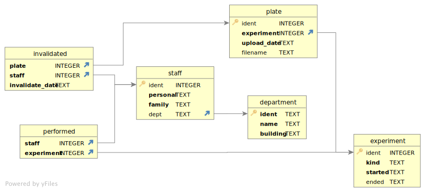

## null: connect to database

```bash
sqlite3 data/penguins.db
```

-   Not actually a query
-   But we have to do it before we can do anything else

## 001: select constant

```sql
select 1;
```
```
1
```

-   `select` is a keyword
-   Normally used to select data from table…
-   …but if all we want is a constant value, we don't need to specify one
-   Semi-colon terminator is required

## 002: select all values from table

```sql
select * from little_penguins;
```
```
Adelie|Torgersen|38.5|17.9|190|3325|FEMALE
Adelie|Biscoe|37.7|18.7|180|3600|MALE
Adelie|Torgersen|37.3|20.5|199|3775|MALE
Adelie|Dream|40.7|17|190|3725|MALE
Chinstrap|Dream|51|18.8|203|4100|MALE
Chinstrap|Dream|51.9|19.5|206|3950|MALE
Adelie|Dream|38.8|20|190|3950|MALE
Gentoo|Biscoe|45.2|15.8|215|5300|MALE
Adelie|Torgersen|35.9|16.6|190|3050|FEMALE
Chinstrap|Dream|45.2|16.6|191|3250|FEMALE
```

-   Use `*` to mean "all columns"
-   Use <code>from <em>tablename</em></code> to specify table
-   Output format is not particularly readable

## null: administrative commands

```sql
.headers on
.mode markdown
select * from little_penguins;
```
```
|  species  |  island   | bill_length_mm | bill_depth_mm | flipper_length_mm | body_mass_g |  sex   |
|-----------|-----------|----------------|---------------|-------------------|-------------|--------|
| Adelie    | Torgersen | 38.5           | 17.9          | 190               | 3325        | FEMALE |
| Adelie    | Biscoe    | 37.7           | 18.7          | 180               | 3600        | MALE   |
| Adelie    | Torgersen | 37.3           | 20.5          | 199               | 3775        | MALE   |
| Adelie    | Dream     | 40.7           | 17            | 190               | 3725        | MALE   |
| Chinstrap | Dream     | 51             | 18.8          | 203               | 4100        | MALE   |
| Chinstrap | Dream     | 51.9           | 19.5          | 206               | 3950        | MALE   |
| Adelie    | Dream     | 38.8           | 20            | 190               | 3950        | MALE   |
| Gentoo    | Biscoe    | 45.2           | 15.8          | 215               | 5300        | MALE   |
| Adelie    | Torgersen | 35.9           | 16.6          | 190               | 3050        | FEMALE |
| Chinstrap | Dream     | 45.2           | 16.6          | 191               | 3250        | FEMALE |
```

-   SQLite administrative commands start with `.` and *aren't* part of the SQL standard
    -   PostgreSQL's special commands start with `\`
-   Use `.help` for a complete list

## 003: specify columns

```sql
select species, island, sex
from little_penguins;
```
```
|  species  |  sex   |  island   |
|-----------|--------|-----------|
| Adelie    | FEMALE | Torgersen |
| Adelie    | MALE   | Biscoe    |
| Adelie    | MALE   | Torgersen |
| Adelie    | MALE   | Dream     |
| Chinstrap | MALE   | Dream     |
| Chinstrap | MALE   | Dream     |
| Adelie    | MALE   | Dream     |
| Gentoo    | MALE   | Biscoe    |
| Adelie    | FEMALE | Torgersen |
| Chinstrap | FEMALE | Dream     |
```

-   Specify column names separated by commas
    -   In any order
    -   Duplicates allowed
-   Line breaks ~allowed~ encouraged for readability

## 004: sort

```sql
select species, sex, island
from little_penguins
order by island asc, sex desc;
```
```
|  species  |  sex   |  island   |
|-----------|--------|-----------|
| Adelie    | MALE   | Biscoe    |
| Gentoo    | MALE   | Biscoe    |
| Adelie    | MALE   | Dream     |
| Chinstrap | MALE   | Dream     |
| Chinstrap | MALE   | Dream     |
| Adelie    | MALE   | Dream     |
| Chinstrap | FEMALE | Dream     |
| Adelie    | MALE   | Torgersen |
| Adelie    | FEMALE | Torgersen |
| Adelie    | FEMALE | Torgersen |
```

-   `order by` must follow `from` (which must follow `select`)
-   `asc` is ascending, `desc` is descending
    -   Default is ascending, but please specify

## 005: limit output

-   Full dataset has 344 rows

```sql
select species, sex, island
from penguins -- full table
limit 5;
```
```
| species |  sex   |  island   |
|---------|--------|-----------|
| Adelie  | MALE   | Torgersen |
| Adelie  | FEMALE | Torgersen |
| Adelie  | FEMALE | Torgersen |
| Adelie  |        | Torgersen |
| Adelie  | FEMALE | Torgersen |
```

-   Comments start with `--` and run to the end of the line
-   <code>limit <em>N</em></code> specifies maximum number of rows returned by query

## 006: page output

```sql
select species, sex, island
from penguins
limit 5 offset 5;
```
```
| species |  sex   |  island   |
|---------|--------|-----------|
| Adelie  | MALE   | Torgersen |
| Adelie  | FEMALE | Torgersen |
| Adelie  | MALE   | Torgersen |
| Adelie  |        | Torgersen |
| Adelie  |        | Torgersen |
```

-   <code>offset <em>N</em></code> must follow `limit`
-   Specifies number of rows to skip

## 007: remove duplicates

```sql
select distinct species, sex, island
from penguins;
```
```
|  species  |  sex   |  island   |
|-----------|--------|-----------|
| Adelie    | MALE   | Torgersen |
| Adelie    | FEMALE | Torgersen |
| Adelie    |        | Torgersen |
| Adelie    | FEMALE | Biscoe    |
| Adelie    | MALE   | Biscoe    |
| Adelie    | FEMALE | Dream     |
| Adelie    | MALE   | Dream     |
| Adelie    |        | Dream     |
| Chinstrap | FEMALE | Dream     |
| Chinstrap | MALE   | Dream     |
| Gentoo    | FEMALE | Biscoe    |
| Gentoo    | MALE   | Biscoe    |
| Gentoo    |        | Biscoe    |
```

-   `distinct` keyword must appear right after `select`
    -   SQL was supposed to read like English…
-   Shows distinct combinations
-   Blanks in `sex` column show missing data
    -   We'll talk about this in a bit

## 008: filter results

```sql
select distinct species, sex, island
from penguins
where island = "Biscoe";
```
```
| species |  sex   | island |
|---------|--------|--------|
| Adelie  | FEMALE | Biscoe |
| Adelie  | MALE   | Biscoe |
| Gentoo  | FEMALE | Biscoe |
| Gentoo  | MALE   | Biscoe |
| Gentoo  |        | Biscoe |
```

-   <code>where <em>condition</em></code> filters the rows produced by selection
-   Condition is evaluated independently for each row
-   Only rows that pass the test appear in results

## 009: filter with more complex conditions

```sql
select distinct species, sex, island
from penguins
where island = "Biscoe" and sex != "MALE";
```
```
| species |  sex   | island |
|---------|--------|--------|
| Adelie  | FEMALE | Biscoe |
| Gentoo  | FEMALE | Biscoe |
```

-   `and`: both sub-conditions must be true
-   `or`: either or both part must be true
-   Notice that the row for Gentoo penguins on Biscoe island with unknown (empty) sex didn't pass the test
    -   We'll talk about this in a bit

## 010: do calculations

```sql
select
    flipper_length_mm / 10.0,
    body_mass_g / 1000.0
from penguins
limit 3;
```
```
| flipper_length_mm / 10.0 | body_mass_g / 1000.0 |
|--------------------------|----------------------|
| 18.1                     | 3.75                 |
| 18.6                     | 3.8                  |
| 19.5                     | 3.25                 |
```

-   Can do the usual kinds of arithmetic on individual values
    -   Calculation done for each row independently
-   Column name shows the calculation done

## 011: rename columns

```sql
select
    flipper_length_mm / 10.0 as flipper_cm,
    body_mass_g / 1000.0 as weight_kg,
    island as where_found
from penguins
limit 3;
```
```
| flipper_cm | weight_kg | where_found |
|------------|-----------|-------------|
| 18.1       | 3.75      | Torgersen   |
| 18.6       | 3.8       | Torgersen   |
| 19.5       | 3.25      | Torgersen   |
```

-   Use <code><em>expression</em> as <em>name</em></code> to rename
-   Give result of calculation a meaningful name
-   Can also rename columns without modifying

## 012: calculate with missing values

```sql
select
    flipper_length_mm / 10.0 as flipper_cm,
    body_mass_g / 1000.0 as weight_kg,
    island as where_found
from penguins
limit 5;
```
```
| flipper_cm | weight_kg | where_found |
|------------|-----------|-------------|
| 18.1       | 3.75      | Torgersen   |
| 18.6       | 3.8       | Torgersen   |
| 19.5       | 3.25      | Torgersen   |
|            |           | Torgersen   |
| 19.3       | 3.45      | Torgersen   |
```

-   SQL uses a special value `null` to representing missing data
    -   Not 0 or empty string, but "I don't know"
-   Flipper length and body weight not known for one of the first five penguins
-   "I don't know" divided by 10 or 1000 is "I don't know"

## 013: null equality

```sql
-- repeated from earlier so it doesn't count against our query limit
select distinct species, sex, island
from penguins
where island = "Biscoe";
```
```
| species |  sex   | island |
|---------|--------|--------|
| Adelie  | FEMALE | Biscoe |
| Adelie  | MALE   | Biscoe |
| Gentoo  | FEMALE | Biscoe |
| Gentoo  | MALE   | Biscoe |
| Gentoo  |        | Biscoe |
```

-   If we ask for female penguins the row with the missing sex drops out

```sql
select distinct species, sex, island
from penguins
where island = "Biscoe" and sex == "FEMALE";
```
```
| species |  sex   | island |
|---------|--------|--------|
| Adelie  | FEMALE | Biscoe |
| Gentoo  | FEMALE | Biscoe |
```

## 014: null inequality

-   But if we ask for penguins that *aren't* female it drops out as well

```sql
select distinct species, sex, island
from penguins
where island = "Biscoe" and sex != "FEMALE";
```
```
| species | sex  | island |
|---------|------|--------|
| Adelie  | MALE | Biscoe |
| Gentoo  | MALE | Biscoe |
```

## 015: ternary logic

```sql
select null = null;
```
```
| null = null |
|-------------|
|             |
```

-   If we don't know the left and right values, we don't know if they're equal or not
-   So the result is `null`
-   Get the same answer for `null != null`

-   *three-valued logic*

<table>
  <tr>
    <th colspan="4">equality</th>
  </tr>
  <tr>
    <th></th>
    <th>X</th>
    <th>Y</th>
    <th>null</th>
  </tr>
  <tr>
    <th>X</th>
    <td>true</td>
    <td>false</td>
    <td>null</td>
  </tr>
  <tr>
    <th>Y</th>
    <td>false</td>
    <td>true</td>
    <td>null</td>
  </tr>
  <tr>
    <th>null</th>
    <td>null</td>
    <td>null</td>
    <td>null</td>
  </tr>
</table>

## 016: handle null safely

```sql
select species, sex, island
from penguins
where sex is null;
```
```
| species | sex |  island   |
|---------|-----|-----------|
| Adelie  |     | Torgersen |
| Adelie  |     | Torgersen |
| Adelie  |     | Torgersen |
| Adelie  |     | Torgersen |
| Adelie  |     | Torgersen |
| Adelie  |     | Dream     |
| Gentoo  |     | Biscoe    |
| Gentoo  |     | Biscoe    |
| Gentoo  |     | Biscoe    |
| Gentoo  |     | Biscoe    |
| Gentoo  |     | Biscoe    |
```

-   Use `is null` and `is not null` to handle null safely
-   Other parts of SQL handle nulls specially

## 017: aggregate

```sql
select sum(body_mass_g) as total_mass
from penguins;
```
```
| total_mass |
|------------|
| 1437000    |
```

-   `sum` is an *aggregation function*
-   Combines corresponding values from multiple rows

## 018: common aggregation functions

```sql
select
    max(bill_length_mm) as longest_bill,
    min(flipper_length_mm) as shortest_flipper,
    avg(bill_length_mm) / avg(bill_depth_mm) as weird_ratio
from penguins;
```
```
| longest_bill | shortest_flipper |   weird_ratio    |
|--------------|------------------|------------------|
| 59.6         | 172              | 2.56087082530644 |
```

-   This actually shouldn't work: can't calculate maximum or average if any values are null
-   SQL does the useful thing instead of the right one

## 019: group

```sql
select
    avg(body_mass_g) as average_mass_g
from penguins
group by sex;
```
```
|  average_mass_g  |
|------------------|
| 4005.55555555556 |
| 3862.27272727273 |
| 4545.68452380952 |
```

-   Put rows in buckets based on distinct combinations of values in columns specified with `group by`
-   Then perform aggregation separately for each bucket
-   But, uh, which is which?

## 020: behavior of unaggregated columns

```sql
select
    sex,
    avg(body_mass_g) as average_mass_g
from penguins
group by sex;
```
```
|  sex   |  average_mass_g  |
|--------|------------------|
|        | 4005.55555555556 |
| FEMALE | 3862.27272727273 |
| MALE   | 4545.68452380952 |
```

-   All rows in each group have the same value for `sex`, so no need to aggregate

## 021: arbitrary choice in aggregation

```sql
select
    sex,
    body_mass_g                   
from penguins
group by sex;
```
```
|  sex   | body_mass_g |
|--------|-------------|
|        |             |
| FEMALE | 3800        |
| MALE   | 3750        |
```

-   If we don't specify how to aggregate a column, SQL can choose *any arbitrary value* from the group
-   All penguins in each group have the same sex because we grouped by that, so we get the right answer
-   The body mass values are in the data but unpredictable
-   A common mistake

## 022: filter aggregated values

```sql
select
    sex,
    avg(body_mass_g) as average_mass_g
from penguins
group by sex
having average_mass_g > 4000.0;
```
```
| sex  |  average_mass_g  |
|------|------------------|
|      | 4005.55555555556 |
| MALE | 4545.68452380952 |
```

-   Using <code>having <em>condition</em></code> instead of <code>where <em>condition</em></code> for aggregates

## 023: readable output

```sql
select
    sex,
    round(avg(body_mass_g), 1) as average_mass_g
from penguins
group by sex
having average_mass_g > 4000.0;
```
```
| sex  | average_mass_g |
|------|----------------|
|      | 4005.6         |
| MALE | 4545.7         |
```

-   Use <code>round(<em>value</em>, <em>decimals</em>)</code> to round off a number

## null: create in-memory database

```bash
$ sqlite3 :memory:
```

-   "Connect" to an *in-memory* database

## 024: create tables

```sql
create table work(
    person text not null,
    job text not null
);
create table job(
    name text not null,
    billable real not null
);
```

-   <code>create table <em>name</em></code> followed by parenthesized list of columns
-   Each column is a name, a data type, and optional extra information
    -   E.g., `not null` prevents nulls from being added

## 025: insert data

```sql
insert into job values
    ("calibrate", 1.5),
    ("clean", 0.5)
;
insert into work values
    ("mik", "calibrate"),
    ("mik", "clean"),
    ("mik", "complain"),
    ("po", "clean"),
    ("po", "complain"),
    ("tay", "complain")
;
```

-   Resulting tables

|   name    | billable |
|-----------|----------|
| calibrate | 1.5      |
| clean     | 0.5      |

| person |    job    |
|--------|-----------|
| mik    | calibrate |
| mik    | clean     |
| mik    | complain  |
| po     | clean     |
| po     | complain  |
| tay    | complain  |

## 026: join tables

```sql
select *
from work cross join job;
```
```
| person |    job    |   name    | billable |
|--------|-----------|-----------|----------|
| mik    | calibrate | calibrate | 1.5      |
| mik    | calibrate | clean     | 0.5      |
| mik    | clean     | calibrate | 1.5      |
| mik    | clean     | clean     | 0.5      |
| mik    | complain  | calibrate | 1.5      |
| mik    | complain  | clean     | 0.5      |
| po     | clean     | calibrate | 1.5      |
| po     | clean     | clean     | 0.5      |
| po     | complain  | calibrate | 1.5      |
| po     | complain  | clean     | 0.5      |
| tay    | complain  | calibrate | 1.5      |
| tay    | complain  | clean     | 0.5      |
```

-   `cross join` (also called *outer join*) constructs cross product of tables
    -   All combinations of rows from each
-   Result isn't particularly useful: `job` and `name` don't match

## 027: inner join

```sql
select *
from work inner join job on work.job = job.name;
```
```
| person |    job    |   name    | billable |
|--------|-----------|-----------|----------|
| mik    | calibrate | calibrate | 1.5      |
| mik    | clean     | clean     | 0.5      |
| po     | clean     | clean     | 0.5      |
```

-   Use <code><em>table</em>.<em>column</em></code> notation to specify columns
    -   A column can have the same name as a table
-   Use <code>on <em>condition</em></code> to specify *join condition*
-   Since `complain` doesn't appear in `job.name`, none of those rows are kept

## 028: aggregate joined data

```sql
select
    work.person,
    sum(job.billable) as pay
from work inner join job on work.job = job.name
group by work.person;
```
```
| person | pay |
|--------|-----|
| mik    | 2.0 |
| po     | 0.5 |
```

-   Combines ideas we've seen before
-   But Tay is missing from the table

## 029: left join

```sql
select *
from work left join job on work.job = job.name;
```
```
| person |    job    |   name    | billable |
|--------|-----------|-----------|----------|
| mik    | calibrate | calibrate | 1.5      |
| mik    | clean     | clean     | 0.5      |
| mik    | complain  |           |          |
| po     | clean     | clean     | 0.5      |
| po     | complain  |           |          |
| tay    | complain  |           |          |
```

-   A *left outer join* keeps all rows from the left table
-   Fills missing values from right table with null

## 030: aggregate left joins

```sql
select
    work.person,
    sum(job.billable) as pay
from work left join job on work.job = job.name
group by work.person;
```
```
| person | pay |
|--------|-----|
| mik    | 2.0 |
| po     | 0.5 |
| tay    |     |
```

-   That's better, but we'd like to see 0 rather than a blank

## 031: coalesce values

```sql
select
    work.person,
    coalesce(sum(job.billable), 0.0) as pay
from work left join job on work.job = job.name
group by work.person;
```
```
| person | pay |
|--------|-----|
| mik    | 2.0 |
| po     | 0.5 |
| tay    | 0.0 |
```

-   <code>coalesce(<em>val1</em>, <em>val2</em>, …)</code> returns first non-null value

## 032: negate incorrectly

-   Who doesn't calibrate?

```sql
select distinct person
from work
where job != "calibrate";
```
```
| person |
|--------|
| mik    |
| po     |
| tay    |
```

-   But Mik *does* calibrate
-   Problem is that there's an entry for Mik cleaning
-   And since `"clean" != "calibrate"`, that row is included in the results
-   We need a different approach

## 033: set membership

```sql
select *
from work
where person not in ("mik", "tay");
```
```
| person |   job    |
|--------|----------|
| po     | clean    |
| po     | complain |
```

-   <code>in <em>values</em></code> and <code>not in <em>values</em></code> do exactly what you expect

## 034: subqueries

```sql
select distinct person
from work
where person not in (
    select distinct person
    from work
    where job = "calibrate"
);
```
```
| person |
|--------|
| po     |
| tay    |
```

-   Use a *subquery* to select the people who *do* calibrate
-   Then select all the people who aren't in that set
-   Initially feels odd, but subqueries are useful in other ways

## null: M to N relationships

-   Relationships between entities are usually characterized as:
    -   1-to-1: fields in the same record
    -   1-to-many: the many have a *foreign key* referring to the one's *primary key*
    -   many-to-many: don't know how many keys to add to records ("maximum" never is)
-   Nearly-universal solution is a *join table*
    -   Each record is a pair of foreign keys
    -   I.e., each record is the fact that records A and B are related

## 035: autoincrement and primary key

```sql
create table person(
    ident integer primary key autoincrement,
    name text not null
);
insert into person values
    (null, "mik"),
    (null, "po"),
    (null, "tay")
;
select * from person;
```
```
| ident | name |
|-------|------|
| 1     | mik  |
| 2     | po   |
| 3     | tay  |
```

-   Database automatically increments `ident` each time a new record is added
-   Use that field as the primary key
    -   So that if Mik changes their name again, we only have to change one fact in the database
    -   Downside: manual queries are harder to read (who is person 17?)

## 036: alter tables

```sql
alter table job
add ident integer not null default -1;

update job
set ident = 1
where name = "calibrate";

update job
set ident = 2
where name = "clean";

select * from job;
```
```
|   name    | billable | ident |
|-----------|----------|-------|
| calibrate | 1.5      | 1     |
| clean     | 0.5      | 2     |
```

-   Add a column after the fact
-   Since it can't be null, we have to provide a default value
    -   Really want to make it the primary key, but SQLite doesn't allow that (easily) after the fact
-   Then use `update` to modify existing records
    -   Can modify any number of records at once
    -   So be careful about `where` clause
-   *Data migration*

## 037: create new tables from old

```sql
create table new_work(
    person_id integer not null,
    job_id integer not null,
    foreign key(person_id) references person(ident),
    foreign key(job_id) references job(ident)
);

insert into new_work
select
    person.ident as person_id,
    job.ident as job_id
from
    (person join work on person.name = work.person)
    join job on job.name = work.job
;
select * from new_work;
```
```
| person_id | job_id |
|-----------|--------|
| 1         | 1      |
| 1         | 2      |
| 2         | 2      |
```

-   `new_work` is our join table
-   Each column refers to a record in some other table

## 038: remove tables

```sql
drop table work;
alter table new_work rename to work;
```

-   Remove the old table and rename the new one to take its place
-   Be careful…

## null: display schema

```
.schema
```
```
CREATE TABLE job(
    name text not null,
    billable real not null,
    ident integer not null default -1
);
CREATE TABLE person(
    ident integer primary key autoincrement,
    name text not null
);
CREATE TABLE sqlite_sequence(name, seq);
CREATE TABLE IF NOT EXISTS "work"(
    person_id integer not null,
    job_id integer not null,
    foreign key(person_id) references person(ident),
    foreign key(job_id) references job(ident)
);
```

-   Remember, `.schema` is *not* standard SQL
-   SQLite has added a few things
    -   `create if not exists`
    -   upper-case keywords (SQL is case insensitive)
    -   sequence ID table

```sql
select * from sqlite_sequence;
```
```
|  name  | seq |
|--------|-----|
| person | 3   |
```

## 039: compare individual values to aggregates

-   Go back to penguins

```sql
select body_mass_g
from penguins
where body_mass_g > (
   select avg(body_mass_g)
   from penguins
)
limit 5;
```
```
| body_mass_g |
|-------------|
| 4675        |
| 4250        |
| 4400        |
| 4500        |
| 4650        |
```

-   Get average body mass in subquery
-   Compare each row against that
-   Requires two scans of the data, but there's no way to avoid that
-   Null values aren't included in the average or in the final results

## 040: self join

```sql
select distinct left.species, right.species
from penguins as left join penguins as right;
```
```
|  species  |  species  |
|-----------|-----------|
| Adelie    | Adelie    |
| Adelie    | Chinstrap |
| Adelie    | Gentoo    |
| Chinstrap | Adelie    |
| Chinstrap | Chinstrap |
| Chinstrap | Gentoo    |
| Gentoo    | Adelie    |
| Gentoo    | Chinstrap |
| Gentoo    | Gentoo    |
```

-   Join a table to itself
    -   Give copies aliases using `as` to distinguish them
    -   Nothing special about `left` and `right`

## 041: generate unique pairs

```sql
select distinct left.species, right.species
from penguins as left join penguins as right
on left.species < right.species;
```
```
|  species  |  species  |
|-----------|-----------|
| Adelie    | Chinstrap |
| Adelie    | Gentoo    |
| Chinstrap | Gentoo    |
```

-   Quick check: *n(n-1)/2* unique pairs

## 042: compare individual values to aggregates within groups

```sql
select
    left.species,
    left.body_mass_g,
    round(right.avg_mass_g, 1) as avg_mass_g
from penguins as left join (
    select species, avg(body_mass_g) as avg_mass_g
    from penguins
    group by species
) as right
where left.body_mass_g > right.avg_mass_g
limit 5;
```
```
| species | body_mass_g | avg_mass_g |
|---------|-------------|------------|
| Adelie  | 3750        | 3700.7     |
| Adelie  | 3800        | 3700.7     |
| Adelie  | 4675        | 3700.7     |
| Adelie  | 4250        | 3700.7     |
| Adelie  | 3800        | 3700.7     |
```

## 043: common table expressions

```sql
with grouped as (
    select species, avg(body_mass_g) as avg_mass_g
    from penguins
    group by species
)
select
    penguins.species,
    penguins.body_mass_g,
    round(grouped.avg_mass_g, 1) as avg_mass_g
from penguins join grouped
where penguins.body_mass_g > grouped.avg_mass_g
limit 5;
```
```
| species | body_mass_g | avg_mass_g |
|---------|-------------|------------|
| Adelie  | 3750        | 3700.7     |
| Adelie  | 3800        | 3700.7     |
| Adelie  | 4675        | 3700.7     |
| Adelie  | 4250        | 3700.7     |
| Adelie  | 3800        | 3700.7     |
```

-   Use *common table expression* (CTE) to make queries clearer
    -   Nested subqueries quickly become difficult to understand
-   Database decides how to optimize

## null: explain query

```sql
explain
select
    species,
    avg(body_mass_g)
from penguins
group by species;
```
```
addr  opcode         p1    p2    p3    p4             p5  comment      
----  -------------  ----  ----  ----  -------------  --  -------------
 0    Init            0    43     0                   0   Start at 43
 1    SorterOpen      1     2     0    k(1,B)         0   
 2    Integer         0     2     0                   0   r[2]=0
 3    Null            0     5     5                   0   r[5..5]=NULL
 4    Gosub           4    39     0                   0   
 5    OpenRead        0     2     0    6              0   root=2 iDb=0
 6    Rewind          0    12     0                   0   
 7    Column          0     0    10                   0   r[10]= cursor 0 column 0
 8    Column          0     5    11                   0   r[11]= cursor 0 column 5
 9    MakeRecord     10     2    12                   0   r[12]=mkrec(r[10..11])
10    SorterInsert    1    12     0                   0   key=r[12]
11    Next            0     7     0                   1   
12    OpenPseudo      2    12     2                   0   2 columns in r[12]
13    SorterSort      1    42     0                   0   GROUP BY sort
14    SorterData      1    12     2                   0   r[12]=data
15    Column          2     0     6                   0   r[6]= cursor 2 column 0
16    Compare         5     6     1    k(1,B)         0   r[5] <-> r[6]
17    Jump           18    22    18                   0   
18    Move            6     5     1                   0   r[5]=r[6]
19    Gosub           3    32     0                   0   output one row
20    IfPos           2    42     0                   0   if r[2]>0 then r[2]-=0, goto 42
21    Gosub           4    39     0                   0   reset accumulator
22    Column          2     1    13                   0   r[13]=penguins.body_mass_g
23    AggStep         0    13     9    avg(1)         1   accum=r[9] step(r[13])
24    If              1    26     0                   0   
25    Column          2     0     7                   0   r[7]=penguins.species
26    Integer         1     1     0                   0   r[1]=1
27    SorterNext      1    14     0                   0   
28    Gosub           3    32     0                   0   output final row
29    Goto            0    42     0                   0   
30    Integer         1     2     0                   0   r[2]=1
31    Return          3     0     0                   0   
32    IfPos           1    34     0                   0   if r[1]>0 then r[1]-=0, goto 34
33    Return          3     0     0                   0   
34    AggFinal        9     1     0    avg(1)         0   accum=r[9] N=1
35    Copy            7    14     0                   0   r[14]=r[7]
36    Copy            9    15     0                   0   r[15]=r[9]
37    ResultRow      14     2     0                   0   output=r[14..15]
38    Return          3     0     0                   0   end groupby result generator
39    Null            0     7     9                   0   r[7..9]=NULL
40    Integer         0     1     0                   0   r[1]=0
41    Return          4     0     0                   0   
42    Halt            0     0     0                   0   
43    Transaction     0     0     2    0              1   usesStmtJournal=0
44    Goto            0     1     0                   0
```

## 044: enumerate rows

-   Every table has a special column called `rowid`

```sql
select rowid, *
from penguins
limit 5;
```
```
1|Adelie|Torgersen|39.1|18.7|181|3750|MALE
2|Adelie|Torgersen|39.5|17.4|186|3800|FEMALE
3|Adelie|Torgersen|40.3|18|195|3250|FEMALE
4|Adelie|Torgersen|||||
5|Adelie|Torgersen|36.7|19.3|193|3450|FEMALE
```

-   `rowid` is persistent within a session
    -   I.e., if we delete the first 5 rows we now have row IDs 6…N
-   *Do not rely on row ID*
    -   In particular, do not use it as a key

## null: yet another database

-   *entity-relationship diagram* (ER diagram) shows relationships between tables
-   Like everything to do with databases, there are lots of variations




## 045: select first and last rows

```sql
select * from (
    select * from (select * from experiment order by started asc limit 5)
    union all
    select * from (select * from experiment order by started desc limit 5)
)
order by started asc
;
```
```
| ident |    kind     |  started   |   ended    |
|-------|-------------|------------|------------|
| 16    | trial       | 2023-01-29 | 2023-01-30 |
| 34    | calibration | 2023-01-30 | 2023-01-30 |
| 35    | trial       | 2023-02-02 | 2023-02-03 |
| 24    | trial       | 2023-02-12 | 2023-02-14 |
| 5     | trial       | 2023-02-15 | 2023-02-16 |
| 39    | calibration | 2024-01-21 | 2024-01-21 |
| 11    | trial       | 2024-01-26 | 2024-01-28 |
| 43    | trial       | 2024-01-27 | 2024-01-29 |
| 33    | trial       | 2024-02-01 | 2024-02-02 |
| 13    | calibration | 2024-02-03 | 2024-02-03 |
```

-   `union all` combines records
    -   Keeps duplicates: `union` on its own keeps unique records
-   Yes, it feels like the extra `select * from` should be unnecessary
-   `intersect` and `except` perform set intersection and one-sided set difference respectively

## 046: generate sequence

```sql
select value from generate_series(1, 5);
```
```
| value |
|-------|
| 1     |
| 2     |
| 3     |
| 4     |
| 5     |
```

-   A (non-standard) *table-valued function*

## 047: generate sequence sequence based on data

```sql
create table temp(
    num integer not null
);
insert into temp values (1), (5);
select value from generate_series(
    (select min(num) from temp),
    (select max(num) from temp)
);
```
```
| value |
|-------|
| 1     |
| 2     |
| 3     |
| 4     |
| 5     |
```

-   Must have the parentheses around the `min` and `max` selections to keep SQLite happy

## 048: generate sequence of dates

```sql
select
    date((select julianday(min(started)) from experiment) + value) as some_day
from (
    select value from generate_series(
        (select 0),
        (select count(*) - 1 from experiment)
    )
)
limit 5;
```

-   SQLite represents dates as YYYY-MM-DD strings or as Julian days or as Unix milliseconds or…
    -   Julian days is fractional number of days since November 24, 4714 BCE
-   `julianday` and `date` convert back and forth

## 049: count experiments started per day without gaps

```sql
with
-- complete sequence of days with 0 as placeholder for number of experiments
all_days as (
    select
        date((select julianday(min(started)) from experiment) + value) as some_day,
	0 as zeroes
    from (
        select value from generate_series(
            (select 0),
            (select count(*) - 1 from experiment)
        )
    )
),
-- sequence of actual days with actual number of experiments started
actual_days as (
    select started, count(started) as num_exp
    from experiment
    group by started
)
-- combined by joining on day and taking actual number (if available) or zero
select
    all_days.some_day as day,
    coalesce(actual_days.num_exp, all_days.zeroes) as num_exp
from
    all_days left join actual_days on all_days.some_day = actual_days.started
limit 5
;
```
```
|    day     | num_exp |
|------------|---------|
| 2023-01-29 | 1       |
| 2023-01-30 | 1       |
| 2023-01-31 | 0       |
| 2023-02-01 | 0       |
| 2023-02-02 | 1       |
```

---

## To Do

-   correlated subquery
-   cast
-   between
-   exists
-   case
-   current_date
-   window over/partition
-   begin/end transaction, commit, rollback, and raise
-   with recursive
-   functions
    -   concat
    -   glob and like
    -   iif (short form for case)
    -   random
    -   length / replace / substr / lower string functions
-   triggers
-   JSON
-   blobs
-   upsert
-   returning (to get back rows modified or deleted)
-   on conflict (upsert)
